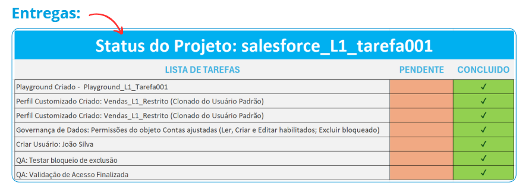

# ☁️ Salesforce L1: Construindo a Fundação para Projetos Escaláveis

## 🎯 Objetivo do Projeto:
Este projeto visa a construção e configuração de um ambiente Salesforce (Playground) do zero, focando no domínio das funcionalidades essenciais de Nível 1 (L1). O foco não é apenas a execução, mas a excelência na entrega de configurações fundamentais que garantam a escalabilidade e a segurança da Org.

## 🔵 Por que começar por tarefas L1?
Muitas falhas críticas em grandes implementações Salesforce (como vazamento de dados ou automações conflitantes) ocorrem porque a base não foi bem feita. Começar pelo L1 permite:
1. Domínio da Segurança: Entender o fluxo de visibilidade (quem vê o quê) antes de criar processos complexos.
2. Integridade de Dados: Garantir que o usuário final insira informações corretas desde o primeiro dia.
3. Redução de Débito Técnico: Configurações limpas e padronizadas facilitam manutenções futuras e evitam retrabalho.

## 💡 Tecnologias e Ferramentas:
1. Plataforma e Core:
* Salesforce Platform: Utilização de um ambiente Trailhead Playground para a construção e configuração da Org do zero.
* Administração Declarativa (Clicks over Code): Foco em configurações nativas para garantir a escalabilidade e reduzir o débito técnico.
* Licença Salesforce: Escolha estratégica para garantir acesso total aos objetos de vendas como Contas, Contatos e Leads.
2. Segurança e Governança:
* Segurança de Dados (CRUD): Implementação de controle de acesso em nível de objeto para garantir a integridade dos dados.
* Gestão de Perfis: Técnica de clonagem do perfil Standard User para herdar permissões essenciais de produtividade.
* Princípio do Menor Privilégio: Metodologia aplicada para restringir ações críticas, como a exclusão de registros.
* Login As: Habilitação de login administrativo para validação da experiência do usuário (João Silva) e testes de segurança.
3. Design e Documentação:
* Canva: Ferramenta utilizada para o design e diagramação do Relatório Técnico, garantindo uma comunicação visual clara e profissional das entregas.
* Microsoft Excel: Ferramenta estratégica utilizada para a criação e gestão do Checklist de Excelência, garantindo o controle rigoroso de cada etapa da entrega.

## 📊 Status das Entregas e Relatório Técnico de Alta Fidelidade:
Um dos grandes diferenciais deste projeto foi o cuidado com a apresentação e o acompanhamento das entregas. Entendo que, no ecossistema Salesforce, a documentação é tão importante quanto a configuração técnica.
Por isso, além da execução na Org, dediquei atenção especial a dois pilares de organização profissional:
* Relatório Técnico de Alta Fidelidade: Desenvolvi um relatório completo utilizando a identidade visual da Salesforce (via Canva), documentando não apenas o "o quê" foi feito, mas o "porquê" de cada decisão de governança.
Para conferir o passo a passo completo, as análises de dados e a metodologia aplicada neste projeto, acesse o relatório final: 👉 [**Clique aqui para visualizar o Relatório Técnico Completo (PDF)**](./pdf/relatorio_projeto_L1_001.pdf)
* Checklist de Excelência: Para garantir o padrão de qualidade L1, implementei um Status de Entrega detalhado. Esse checklist serviu como meu guia de QA, assegurando que cada requisito — desde a criação do usuário João Silva até as travas de segurança — fosse validado e concluído com sucesso.

